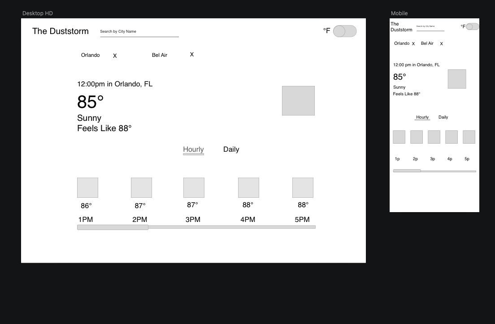
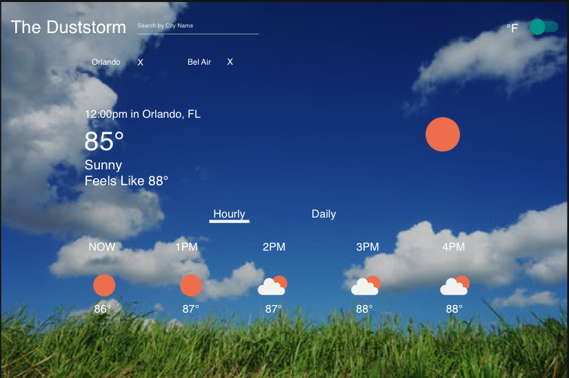

# The Duststorm

### Table of Contents
  - [The Duststorm](#The-Duststorm)
    - [Table of Contents](#table-of-contents)
    - [Overview](#overview)
  - [Design Process](#design-process)
  - [Technologies Used](#technologies-used)
    - [WireFrame](#wireframe)
    - [Mockup](#Mockup)
  - [Functionality](#functionality)
    - [Search by City Name](#Search-by-City-Name)
    - [Save Searched Cities](#Save-Searched-Cities)
    - [Check Hourly and Daily](#Check-Hourly-and-Daily)
    - [Change to °F or °C](#Change-to-°F-or-°C)
    - [Remove Saved Cities](#Remove-Saved-Cities)
  - [Credits](#credits)
      - [Creator](#creator)
        - [2021/09/17](#20210917)

### Overview
A Typescript react application that will take in a city name and retun the current weather, hourly and daily weather of location. Users have the option have their data be presented in °F or °C. when a user searches for a city that city would be saved at the top of their screen. If the user would like to go to a saved city they can click on the city name and be taken to the page for that location. If they would like to delete a saved city, they can click on the X to the right of the city name. The app will remember the last city the User searched for, if the prefer °F or °C, and the saved cities they have.

 - GitHub Repo [Link](https://github.com/Thee-Dust/weather-app)
 - Deploy [Link](https://the-duststorm.herokuapp.com/)

## Design Process

### Wireframe
when thinking of the layout of that app, I wanted to have a single page flat design. so users do not have to scroll down to get more information. All the information they need will be displayed as soon as the page loads. I took some information from the weather channel app and the apple weather app. I chose to add a switch to change between °F and °C so users can chose their preference and if they want to change it all they have to do is click one button.
  
  
### Mockup
  When thinking of the look of the app. I wanted users to know what the weather contion was just by a quick glance of the app. I decided to have a dynamic background, whatever is the current weather condition is of a location the background would represent the weather status. 
  

## Technologies Used
- Typescript
- React
- Hooks
- Router
- Material UI
- Moment.js
- Locoal Storage
- Cypress
- Travis-CI 
- Heroku
- SCSS
- Webpack
- Github
- Open Weather Api

## Functionality
### Search by City Name

### Save Searched Cities

### Check Hourly and Daily

### Change to °F or °C

### Remove Saved Cities

## Credits
#### Creator
<table>
  <tr>
    <td> Dustin Harbaugh <a href="https://github.com/Thee-Dust">GH</td>
  </tr> 
  <td>
    
  </td>
  
</table>

**************************************************************************
### Future Features
  - add cacheing to recent searched cities
  - add auto complete in search field

##### 2021/09/17
**[Back to top](#table-of-contents)**
